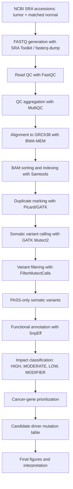

# SomaticVariantCalling_BreastCancer

End-to-end tumor-normal somatic variant calling pipeline for breast cancer sequencing data. The workflow starts from public sequencing accessions, performs FASTQ generation, quality control, read alignment, BAM processing, somatic variant calling with GATK Mutect2, filtering, SnpEff annotation, cancer-gene prioritization, and final visualization of candidate driver mutations.

This repository is designed as a GitHub-ready demonstration of real-world cancer genomics pipeline development. Large raw data files such as FASTQ, SRA, BAM, BAI, compressed VCF, and index files are intentionally excluded. Small result tables, QC reports, alignment metrics, scripts, and final figures are included.

---
# Key Findings

• Processed paired tumor-normal whole genome sequencing data using a reproducible variant-calling workflow.

• Generated high-confidence somatic mutation calls using GATK Mutect2.

• Annotated variants using SnpEff to determine functional consequences and predicted impact.

• Identified 313 HIGH-impact variants and 2468 MODERATE-impact variants.

• Prioritized mutations occurring in known cancer-associated genes.

• Detected candidate driver alterations in genes including PIK3CA, CDH1 and ATM.

• Classified variants according to functional consequence including missense, nonsense and frameshift mutations.

• Generated mutation burden summaries and variant-impact distributions.

• Produced publication-ready visualizations for mutation prioritization and biological interpretation.

• Constructed a reproducible workflow from raw sequencing reads to candidate driver mutation identification.

## Dataset

Input data were handled as matched tumor-normal sequencing data from NCBI SRA accessions used locally in the workflow.

Project accessions used in the local pipeline:

- `SRR19077323`
- `SRR19077324`

The local sample naming used:

- `11871T` for tumor
- `11871N` for matched normal

Small metadata/sample information is stored in:

```text
data/breast5.txt
```

Raw SRA, FASTQ, BAM, and compressed VCF files are not included in this GitHub version.

---

## Project goals

The main goal was to build and document a complete somatic mutation discovery workflow for a tumor-normal breast cancer sample.

Specific objectives:

1. Download / process sequencing reads from public accessions.
2. Perform sequencing quality control.
3. Align tumor and normal reads to the human reference genome.
4. Generate sorted, indexed, duplicate-marked BAM files.
5. Call somatic variants using matched tumor-normal analysis.
6. Filter candidate variants to retain PASS calls.
7. Annotate functional consequences using SnpEff.
8. Prioritize high-impact, moderate-impact, and cancer-gene variants.
9. Generate interpretable visual summaries and candidate driver tables.

---

## Biological motivation

Somatic variant calling identifies mutations present in tumor DNA but absent or much less supported in matched normal DNA. In cancer genomics, these mutations can reveal driver genes, tumor suppressor loss, oncogene activation, DNA repair defects, and clinically relevant candidate targets.

Breast cancer commonly involves alterations in pathways related to:

- PI3K signaling
- DNA damage repair
- cell adhesion and epithelial integrity
- tumor suppressor function
- growth factor signaling

This project demonstrates how a matched tumor-normal workflow can move from sequencing reads to interpretable cancer mutation findings.

---

## Analysis workflow



---

## Tools and software

| Stage | Tool | Purpose |
|---|---|---|
| FASTQ generation | SRA Toolkit / `fasterq-dump` | Convert SRA accessions to paired FASTQ files |
| QC | FastQC | Per-read quality, adapter, GC, sequence quality checks |
| QC aggregation | MultiQC | Combined QC reports |
| Alignment | BWA-MEM | Align reads to GRCh38 reference genome |
| BAM processing | Samtools | Sort and index BAM files |
| Duplicate handling | Picard / GATK | Mark duplicate reads |
| Variant calling | GATK Mutect2 | Matched tumor-normal somatic variant calling |
| Variant filtering | GATK FilterMutectCalls | Retain high-confidence somatic calls |
| VCF handling | bcftools | PASS extraction, stats, variant table creation |
| Annotation | SnpEff | Functional consequence prediction |
| Prioritization | Python / pandas | High-impact and cancer-gene filtering |
| Visualization | matplotlib | Driver, impact, effect, and gene-level plots |

---

## Pipeline stages

### 1. FASTQ generation

SRA accessions were converted to paired-end FASTQ files using SRA Toolkit.

Script:

```text
scripts/run_fasterq_11871.sh
```

Large FASTQ files are excluded from GitHub.

### 2. Quality control

FastQC was used for per-file quality reports. MultiQC was used to combine QC results.

Included outputs:

```text
qc/fastqc/
qc/multiqc/
```

These reports document sequencing quality and provide evidence that the reads were inspected before downstream analysis.

### 3. Alignment and BAM processing

Reads were aligned to the human GRCh38 reference genome using BWA-MEM. BAM files were sorted, indexed, and duplicate-marked with Samtools and Picard/GATK utilities.

Script:

```text
scripts/align_11871.sh
```

Included outputs:

```text
metrics/11871T.metrics.txt
metrics/11871N.metrics.txt
```

Large BAM/BAI/SAM files are excluded from GitHub.

### 4. Somatic variant calling

GATK Mutect2 was used for matched tumor-normal somatic variant calling.

The workflow completed successfully and produced an unfiltered somatic VCF, which was then filtered using FilterMutectCalls.

Final PASS calls:

- **9,823 PASS variants**
- **9,357 SNPs**
- **144 MNPs**
- **322 indels**

PASS-level summary is stored in:

```text
results/11871_somatic_PASS_stats.txt
results/11871_somatic_PASS_variants.tsv
```

Compressed VCF/index files are excluded from GitHub.

### 5. Functional annotation

SnpEff was used to annotate predicted functional consequences.

The annotated variant table is stored in:

```text
results/11871_somatic_PASS_snpeff_table.tsv
```

The SnpEff summary files are stored in:

```text
results/snpEff_summary.html
results/snpEff_genes.txt
```

### 6. Impact classification

Variants were grouped by predicted impact.

| category    |   count |
|:------------|--------:|
| HIGH        |     313 |
| MODERATE    |    2468 |
| Cancer_gene |      22 |

Interpretation:

- HIGH-impact variants include events such as stop-gain, frameshift, splice-disrupting, or other potentially severe changes.
- MODERATE-impact variants include mostly missense or protein-altering changes.
- Cancer-gene variants were prioritized using a curated breast/cancer-relevant gene list.

### 7. Candidate driver prioritization

Candidate driver mutations were prioritized using:

- PASS status
- SnpEff impact
- predicted effect
- known cancer-gene relevance
- TLOD score
- protein-level consequence

Driver candidate summary:

| gene   | effect                                 | impact   | hgvs_c      | hgvs_p       |   tlod |
|:-------|:---------------------------------------|:---------|:------------|:-------------|-------:|
| PIK3CA | missense_variant                       | MODERATE | c.3140A>G   | p.His1047Arg | 301.38 |
| CDH1   | stop_gained                            | HIGH     | c.1003C>T   | p.Arg335*    | 228.38 |
| ATM    | missense_variant                       | MODERATE | c.6154G>A   | p.Glu2052Lys |   9.31 |
| PIK3CA | missense_variant&splice_region_variant | MODERATE | c.2495G>A   | p.Arg832Gln  |   7.87 |
| CDH1   | splice_region_variant&intron_variant   | LOW      | c.1566-7C>T | nan          |   7.43 |
| NF1    | missense_variant&splice_region_variant | MODERATE | c.5609G>A   | p.Arg1870Gln |   7.41 |
| ATM    | missense_variant                       | MODERATE | c.4397G>A   | p.Arg1466Gln |   7.18 |
| CDH1   | missense_variant                       | MODERATE | c.2254G>A   | p.Val752Ile  |   6.68 |

---

## Main biological findings

### PIK3CA p.His1047Arg

The strongest prioritized candidate was:

```text
PIK3CA p.His1047Arg
TLOD = 301.38
Effect = missense_variant
Impact = MODERATE
```

Interpretation:

PIK3CA is a key oncogene in breast cancer. The p.His1047Arg mutation is a well-known activating hotspot in the PI3K pathway. Its very high TLOD score makes it the strongest candidate event in this analysis.

### CDH1 p.Arg335*

A high-impact candidate was:

```text
CDH1 p.Arg335*
TLOD = 228.38
Effect = stop_gained
Impact = HIGH
```

Interpretation:

CDH1 encodes E-cadherin, a key cell-cell adhesion protein. A stop-gain mutation may disrupt epithelial adhesion and tumor suppressor function. This is one of the most biologically important variants in the result set because it is both high-impact and high-confidence.

### ATM missense variants

ATM variants included:

```text
ATM p.Glu2052Lys
ATM p.Arg1466Gln
```

Interpretation:

ATM is involved in DNA damage response. ATM alterations can be relevant to genome instability and DNA repair defects in tumors.

### NF1 and additional cancer-gene variants

NF1 and additional cancer-associated genes were also detected among prioritized cancer-gene variants. These variants should be interpreted cautiously because not every cancer-gene mutation is necessarily a driver; however, they provide useful candidates for follow-up.

---

## Main figures

The folder `main_figures/` contains the main visual summary of the variant calling project.

| Figure | Meaning |
|---|---|
| `11871_driver_candidate_table.png` | Table-style summary of prioritized driver candidates |
| `11871_driver_mutations.png` | TLOD-based bar plot of candidate driver mutations |
| `11871_driver_lollipop_like_plot.png` | Lollipop-style view of candidate driver mutations |
| `11871_cancer_gene_effect_matrix.png` | Gene-by-effect matrix showing cancer-gene mutation consequences |
| `11871_snpeff_impact_counts.png` | Counts of HIGH, MODERATE, LOW, and MODIFIER SnpEff impacts |
| `11871_top_variant_effects.png` | Most common variant consequence types |
| `11871_top_mutated_genes.png` | Genes with highest number of annotated variants |
| `11871_variant_summary.png` | Summary of prioritized variant categories |

The folder `supporting_figures/` contains additional copies and supplementary visualizations.

---

## Repository structure

```text
SomaticVariantCalling_BreastCancer
│
├── README.md
│   Main project explanation, workflow, results, and biological interpretation.
│
├── docs/
│   Workflow notes and project documentation.
│
├── scripts/
│   Shell and Python scripts used for alignment, variant calling,
│   annotation, prioritization, and plotting.
│
├── data/
│   Small sample metadata files only.
│   Raw SRA/FASTQ files are excluded.
│
├── qc/
│   Sequencing quality-control reports.
│
│   ├── fastqc/
│   │   Per-FASTQ FastQC HTML reports.
│   │
│   └── multiqc/
│       Aggregated MultiQC report and small MultiQC data tables.
│
├── metrics/
│   Alignment and duplicate metrics for tumor and normal BAMs.
│
├── main_figures/
│   Main figures showing driver candidates, variant consequences,
│   impact categories, and cancer-gene effects.
│
├── supporting_figures/
│   Extra copies and supporting visualizations.
│
└── results/
    Small result tables from variant filtering, annotation,
    prioritization, and visualization.
```

---

## Important result files

| File | Description |
|---|---|
| `results/11871_somatic_PASS_variants.tsv` | PASS somatic variant table |
| `results/11871_somatic_PASS_stats.txt` | bcftools PASS VCF summary |
| `results/11871_somatic_PASS_snpeff_table.tsv` | Parsed SnpEff annotation table |
| `results/11871_HIGH_impact_variants.tsv` | HIGH-impact variants |
| `results/11871_MODERATE_variants.tsv` | MODERATE-impact variants |
| `results/11871_cancer_gene_variants.tsv` | Variants overlapping curated cancer genes |
| `results/11871_driver_candidate_variants.tsv` | Final prioritized driver candidates |
| `results/11871_driver_candidate_summary_table.tsv` | Compact driver candidate summary |
| `results/11871_variant_priority_summary.tsv` | Counts of HIGH, MODERATE, and cancer-gene variants |
| `results/11871_cancer_gene_variant_interpretation_table.tsv` | Cancer-gene interpretation table |
| `results/snpEff_summary.html` | SnpEff annotation report |
| `metrics/11871T.metrics.txt` | Tumor BAM alignment/duplicate metrics |
| `metrics/11871N.metrics.txt` | Normal BAM alignment/duplicate metrics |

---

## How to run

Activate the environment:

```bash
conda activate scrna
cd ~/Projects/Cancer_pipeline/Variant_Calling
```

Generate FASTQ:

```bash
bash scripts/run_fasterq_11871.sh
```

Align and process BAMs:

```bash
bash scripts/align_11871.sh
```

Run Mutect2 and FilterMutectCalls:

```bash
gatk Mutect2 \
  -R reference/fasta/Homo_sapiens_assembly38.fasta \
  -I bam/11871T.markdup.bam \
  -I bam/11871N.markdup.bam \
  -normal 11871N \
  -O vcf/11871_somatic_unfiltered.vcf.gz

gatk FilterMutectCalls \
  -R reference/fasta/Homo_sapiens_assembly38.fasta \
  -V vcf/11871_somatic_unfiltered.vcf.gz \
  -O vcf/11871_somatic_filtered.vcf.gz
```

Extract PASS variants:

```bash
bcftools view -f PASS \
  -Oz -o vcf/11871_somatic_PASS.vcf.gz \
  vcf/11871_somatic_filtered.vcf.gz
```

Annotate with SnpEff:

```bash
snpEff GRCh38.99 \
  vcf/11871_somatic_PASS.vcf.gz \
  > results/11871_somatic_PASS_snpeff.vcf
```

Extract tables and prioritize variants:

```bash
python scripts/extract_snpeff_table.py
python scripts/prioritize_snpeff_variants.py
python scripts/plot_full_variant_summary.py
python scripts/plot_publication_variant_figures.py
```

---

## Notes on reproducibility

The following file types are excluded from GitHub:

- `.sra`
- `.fastq`
- `.fq.gz`
- `.bam`
- `.bai`
- `.sam`
- `.vcf.gz`
- `.tbi`
- large reference genome files
- cache folders

The repository includes scripts and small outputs needed to understand and reproduce the workflow, but raw data and large alignment files must be regenerated or downloaded separately.

---

## Conclusions

This project demonstrates a complete tumor-normal somatic variant calling pipeline for breast cancer sequencing data. The workflow successfully identified high-confidence somatic variants, annotated their functional effects, prioritized cancer-gene alterations, and produced interpretable visual summaries.

The most important findings were:

- **PIK3CA p.His1047Arg**, a strong candidate activating oncogenic mutation with the highest TLOD.
- **CDH1 p.Arg335\***, a high-impact stop-gain mutation affecting an important epithelial adhesion/tumor suppressor gene.
- **ATM missense mutations**, potentially relevant to DNA damage response.
- **313 HIGH-impact variants**, **2,468 MODERATE-impact variants**, and **22 cancer-gene variants**.

Overall, this repository shows practical experience with real NGS cancer genomics, including QC, alignment, BAM processing, GATK Mutect2, variant filtering, SnpEff annotation, cancer-gene prioritization, and publication-style reporting.

---

## Skills demonstrated

- NGS sequencing workflow development
- Tumor-normal somatic variant calling
- BWA-MEM alignment
- Samtools and Picard/GATK BAM processing
- GATK Mutect2 and FilterMutectCalls
- bcftools VCF processing
- SnpEff annotation
- Cancer-gene prioritization
- Python-based result parsing and visualization
- GitHub-ready cancer genomics project organization
